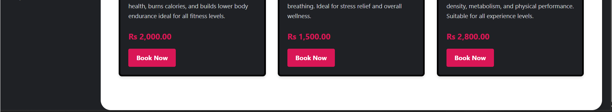
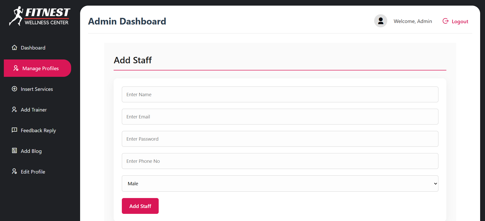

# 🏋️‍♂️ FitNest Wellness Center 🧘‍♀️

FitNest Wellness Center is a comprehensive wellness platform for class bookings, membership management, and community engagement with full CRUD (Create, Read, Update, Delete) functionality across all features, enabling users to manage their fitness journey seamlessly while allowing admins to efficiently control the system.

## ✨ Features

👤 User Roles & Permissions
Role	Key Functions
Customer	<ul><li>📝 Create/Update profile (CRUD)</li><li>🗓️ Book/Cancel classes (Create, Read, Delete)</li><li>💳 Join/Upgrade/Cancel membership (Create, Read, Delete)</li><li>⭐ Write/Edit/Delete reviews (CRUD)</li><li>📊 View class schedules (Read)</li><li> Check BMI & track health metrics (Read/Calculate)</li></ul>
Admin	<ul><li>👥 Manage all user accounts (CRUD)</li><li>➕ Add/Edit/Remove services & classes (CRUD)</li><li>🏋️‍♂️ Manage trainer profiles (CRUD)</li><li>📝 Create/Edit/Delete blog posts (CRUD)</li><li>📊 View all bookings & memberships (Read)</li><li>💬 Reply to/Delete reviews (Update, Delete)</li><li>📈 Generate reports (Read)</li></ul>
Staff/Trainer	<ul><li>👤 Update personal profile (Update)</li><li>📋 View class bookings (Read)</li><li>📅 Manage availability (CRUD)</li><li>💬 Reply to reviews (Update)</li><li>📊 View assigned class participants (Read)</li></ul>

## 📸 Screenshots

### HomePage 🏠

| Feature | Preview |
|---------|---------|
| **Home** |  |
| **About Us Section** |  |
| **Trainer Section** |     |
| **Service Section** |   |
| **Membership Section** |  |
| **Reviews Section** |  |
| **Blog Section** |    |
| **Footer** |  |
| **Example of the one blog** |  |

### Blog Section on the Homepage

Here is an example of how the blog section appears within the homepage:

### SignIn and SignUp pages 

| Feature | Preview |
|---------|---------|
| **SignIn Page** |  |
| **SignUp Page** |   |

### Customer Dashboard 

| Feature | Preview |
|---------|---------|
| **Customer Dashboard** |  |
| **Classes Page** |   |
| **Book Classes** |   |
| **Join Membership** |  |
| **Add Reviews** |    |
| **Edit Profile** |  |

### Admin Dashboard 

| Feature | Preview |
|---------|---------|
| **Customer Dashboard** |**My Classes**  **Memberships** |
| **Manage Profiles** |   |
| **Manage Profiles** |     |
| **Add Trainer** |   |
| **Reply Reviews By Admin** |  |
| **Edit Profile** |  |

## 🛠️ Technologies Used

- HTML5  CSS3
- PHP (Backend)
- MySQL (Database)
- JavaScript (Interactive elements)

